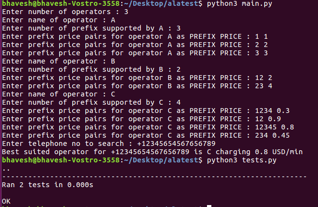

# Tele Q

A Python program that can handle any number of price lists (operators) and then can calculate which operator that is cheapest for a certain telephone number.

* Note: This program has been tested on Python 3.5.2

## Running the app

```
python3 main.py
```

## Running the unittests

```
python3 tests.py
```

## Screenshots




